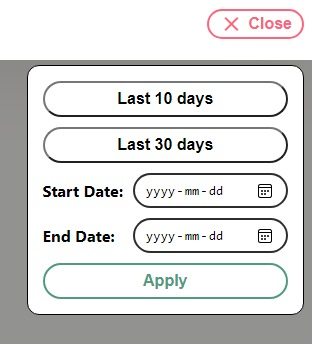
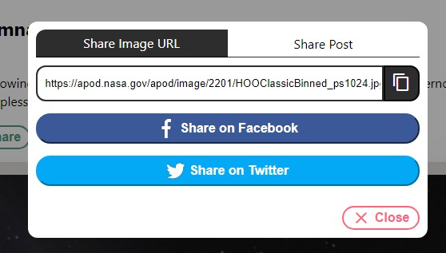
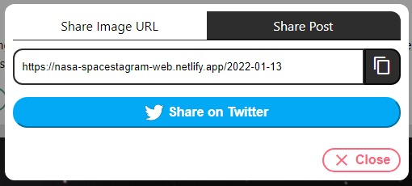
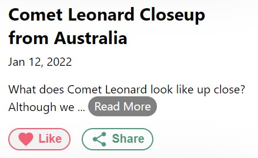
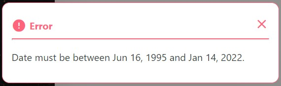
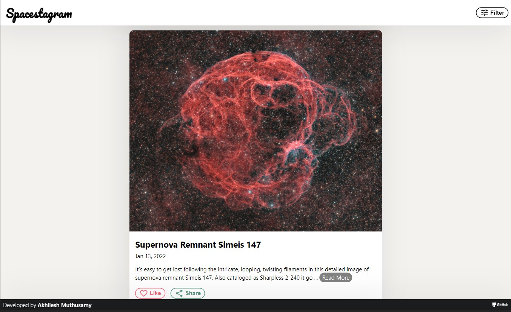
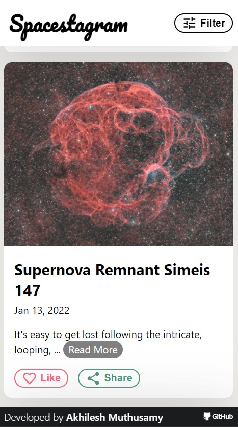

# Spacestagram

## Features

1. Filter Date
2. Share Image
3. Like/Unlike image
4. API Error Handling
5. Mobile Responsive Design

### 1. Filter Date

### 2. Share Image

The share dialog box allows user to share image on facebook/twitter or user can copy the image link to share on other social media platforms.

The 'Share Post' shares the post/article from the Spacestagram website

## 3. Like/Unlike image

When user likes the image the information is stored in the local storage.

## 4. API Error Handling

A dialog box will be shown when there is an API error. The API error is globally handled by HTTPInterceptor service.

## 5. Mobile Responsive Design

### Destopk View

### Mobile View

## Framework

[Angular CLI](https://github.com/angular/angular-cli) version 13.1.2.

## Hosting

<https://nasa-spacestagram-web.netlify.app/>
